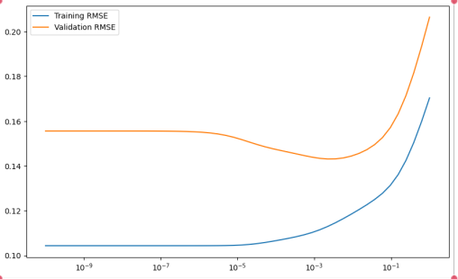

# CAB420 – Machine Learning: Classical Models & CNN Baselines

> **Course:** CAB420 Machine Learning · Queensland University of Technology  
> **Topics:** Regression · Classification · Convolutional Neural Networks

---

## Overview

This project covers three core machine learning tasks using both classical statistical models and deep learning approaches. The goal is to benchmark performance across methods and understand the trade-offs between model complexity, regularisation, and generalisation.

---

## Task 1 – Crime Rate Regression

Predicting violent crime rates from socio-economic features using regularised regression.

### Models

| Model | R² | RMSE |
|---|---|---|
| Linear Regression | 0.890 | 0.1542 |
| Ridge Regression | 0.717 | 0.1431 |
| Lasso Regression | 0.701 | 0.1404 |

**Key findings:**
- Linear regression achieved the highest R² but showed non-constant error variance (heteroscedasticity) in residual plots, suggesting fragile generalisation.
- Ridge (λ = 0.00222) and Lasso (λ = 1.93×10⁻⁶) both improved prediction stability on the validation set.
- Lasso achieved the lowest RMSE despite a lower R², suggesting it generalises better by zeroing out weaker features.

**Ethical note:** Socio-economic predictors can encode historical biases around race and income. Models trained on such data risk amplifying over-policing of specific demographics. Transparent evaluation and fairness auditing are essential before real-world deployment.

---

## Task 2 – Multi-Class Classification

Classifying tabular data using three classical ML models, tuned via grid search.

### Models & Hyperparameters

| Model | Key Params | Test Accuracy |
|---|---|---|
| K-Nearest Neighbours | k=4, metric=Euclidean, weight=distance | 82% |
| Support Vector Machine | C=209, kernel=RBF, strategy=OvO | **87%** |
| Random Forest | n_estimators=59, max_depth=7 | ~82% |

**Key findings:**
- SVM with RBF kernel achieved the best accuracy (87%), effectively capturing non-linear decision boundaries.
- KNN performed well on dense regions but is sensitive to local noise.
- Random Forest was the most interpretable and least prone to overfitting due to depth-limiting.

---

## Task 3 – Image Classification with DCNN

Classifying 28×28 grayscale images (10 classes) using a custom CNN.

### Architecture

```
Input (28×28×1)
→ Conv2D(8, 3×3) → MaxPool(2×2)
→ Conv2D(16, 3×3) → MaxPool(2×2)
→ Conv2D(32, 3×3)
→ Flatten → Dense(64) → Dense(10, Softmax)
```

Trained with Adam optimizer, sparse categorical crossentropy, batch size 64, 45 epochs.

### Results

| Model | Train Accuracy | Test Accuracy | Macro F1 |
|---|---|---|---|
| CDNN (no augmentation) | 85.4% | **70.8%** | **0.67** |
| CDNN (with augmentation) | ~20% | 19% | 0.05 |
| SVM (baseline) | 81% | 19% | 0.14 |

**Key findings:**
- The unaugmented CDNN generalised best, training in ~1.5s and balancing performance across all 10 classes.
- Data augmentation (random rotation ±3°, zoom ±2.5%, translation ±2.5%) hurt performance — the model architecture was too shallow to benefit from the added variability.
- SVM failed to generalise on image data due to its inability to capture spatial feature hierarchies.

---

## Tech Stack

- Python, NumPy, scikit-learn
- TensorFlow / Keras
- Matplotlib (evaluation plots)

---

## 📸 Suggested Images for This Repo

Add these to an `assets/` folder:

| File | What to include |
|---|---|
| `assets/ridge_lambda.png` | RMSE vs Lambda curve for Ridge regression (Figure 1 from report) |
| `assets/lasso_lambda.png` | RMSE vs Lambda curve for Lasso (Figure 2) |
| `assets/linear_residuals.png` | QQ-plot, histogram, and residuals plot for linear regression (Figure 3) |
| `assets/svm_confusion.png` | Confusion matrix for SVM classifier (Figure 7) |
| `assets/dcnn_confusion.png` | Confusion matrix for unaugmented CDNN (Figure 9) |

Reference them in the README:
```markdown

```
